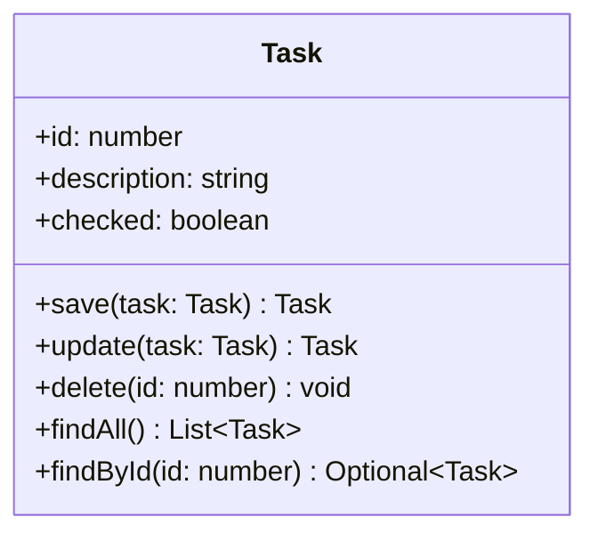

# :notebook_with_decorative_cover: Boas-vindas ao repositório do projeto To Do List! :ballot_box_with_check:

<h3 align="center"><strong> API Rest para gerenciamento de tarefas </strong></h3>

     
     
     
    
    

<h3>Descrição do Projeto</h3>

Essa é uma aplicação que gerencia tarefas, onde, através de uma API Rest, é 
possível criar, editar, excluir e listar tarefas.

<h3> :bookmark_tabs: O usuário será capaz de: </h3>

:heavy_check_mark: Adicionar, remover e editar uma tarefa; 
:heavy_check_mark: Marcar e desmarcar uma tarefa como concluída; 
:heavy_check_mark: Visualizar uma lista com as tarefas cadastradas; 

<h3> Objetivo: </h3>
  
 O principal propósito deste projeto é aplicar os padrões de projeto 
MVC em uma aplicação Java e Spring Boot com frontend desenvolvido em React. 
A intenção é criar uma API Rest totalmente documentada com o auxílio do Swagger. A API será responsável por gerenciar as tarefas de um usuário, integrando o sistema com um banco de dados relacional sem esquecer de aplicar os conceitos de boas práticas em desenvolvimento de software no atendimento aos seguintes requisitos:

<h3><strong> :memo: Requisitos </strong></h3>

- [x] Desenhar o **diagrama de classes** da aplicação com Mermaid;
      
 
 
<strong> Diagrama de Classes </strong>

 O diagrama de classes abaixo oferece uma representação visual clara 
da arquitetura do projeto, destacando as principais entidades e suas 
inter-relações.  
Ao analisar este diagrama, destaca-se a presença central da classe Task, que 
desempenha um papel fundamental nas operações do sistema. Essa representação 
visual simplificada não apenas facilita a compreensão da estrutura existente,
mas também oferece um recurso valioso para orientar futuras implementações e modificações e, estabelece uma base sólida para adaptações e expansões.

  

- [x] Desenvolver a API em Java e Spring Boot;  
- [x] Documentar a API com o Swagger;  
- [x] Estruturar a classe Task no banco de dados com Spring Data JPA;  
- [x] Desenvolver o frontend em React;  
- [ ] Aplicar virtualização de contêineres.  

<h3> :pencil: Orientações </h3>

<li>Antes de executar o banco de dados com o Docker, certifique-se de ter o Docker instalado em sua máquina. Você pode baixá-lo em: <a href="https://www.docker.com/" target="_blank">https://www.docker.com/</a></li>
<li>Antes de iniciar o frontend, certifique-se de ter o Node.js e o npm instalados. Você pode baixá-los em: <a href="https://nodejs.org/" target="_blank">https://nodejs.org/</a></li>
<li>Antes de executar o backend, certifique-se de ter o Java instalado em sua máquina. Você pode baixá-lo em: <a href="https://www.oracle.com/java/technologies/javase-downloads.html" target="_blank">https://www.oracle.com/java/technologies/javase-downloads.html</a></li>
 

 :heavy_check_mark: No Terminal/Console:

<h6> :information_source: Visando facilitar a demostração da aplicação, recomendo a execução do projeto através da IDE do IntelliJ IDEA. </h6>

<ol>
    <li>Faça um clone do projeto na sua máquina: <code>git clone git@github.com:Elisabete-MO/java-react-todolist.git</code></li>
    <li>Abra o projeto no IntelliJ IDEA;</li>
    <li>Entre na pasta raiz do projeto: <code>cd java-react-todo </code></li>
    <li>Execute o comando: <code>docker-compose up -d</code></li> para executar o banco de dados
    <li>Entre na pasta raiz do backend: <code>cd backend</code></li>
    <li>Execute o comando: <code>mvn install</code></li>
    <li>Execute o comando: <code>mvn spring-boot:run</code></li>
    <li>Abra o navegador e digite: <code>http://localhost:8080/swagger-ui.html</code> para visualizar a documentação. O Swagger também permite que alguns dados sejam inseridos, alterados, modificados e excluidos no banco de dados. </li>
    <li>Voltando ao terminal, digite: <code>cd .. && cd frontend/todo-list</code></li>
    <li>Execute o comando: <code>npm start</code> para executar o frontend</li>
</ol>

Se tudo deu certo, a página do "Gerenciador de Tarefas" já abriu no seu navegador padrão e já está pronto para o uso 🎉

